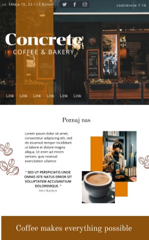
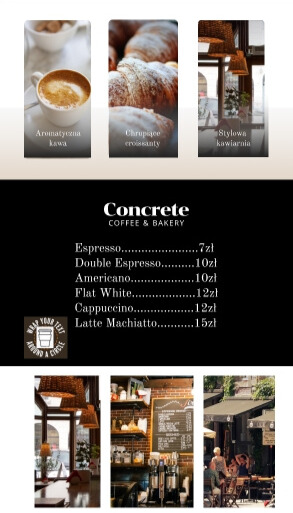

# Concrete Caffee - Concrete CMS Website

I created my first website using Concrete CMS. It was an interesting experience, especially when comparing it to WordPress. To learn Concrete, I had to search deeper for information online, because it's not as popular as WordPress. I made my own project in Figma, created theme and a custom block (which I didn’t use in the end). After that, I saved my local website as a 'complete website' and checked if everything worked properly. I fixed all the issues and then hosted it on a server.

In this CMS, I worked with the code, saw how PHP files are included, and had more control over my project, which I really liked.

## LIVE

[Concrete Caffee - Coffee & Bakery](https://)

## Mockups

